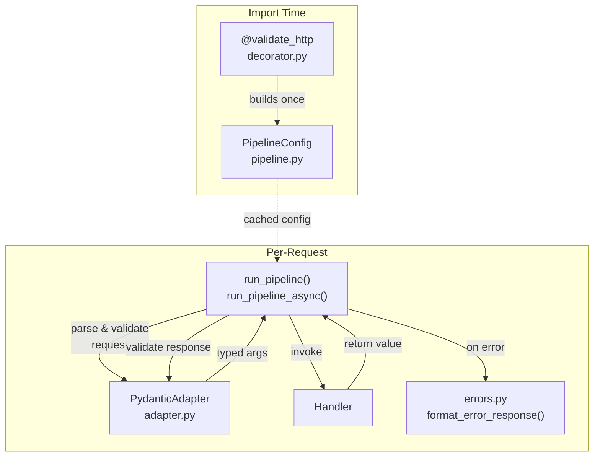

# DESIGN.md

Design Principles for `azure-functions-validation`

## Purpose

This document defines the architectural boundaries and design principles of the project.

## Design Goals

- Provide typed request parsing and response validation for Azure Functions Python v2 handlers.
- Keep the programming model Functions-native and decorator-based.
- Make validation behavior explicit, predictable, and easy to test.
- Stay small, focused, and independently useful.

## Non-Goals

This project does not aim to:

- Become a full application framework
- Replace Azure Functions routing or hosting concepts
- Introduce hidden dependency injection or global state
- Own OpenAPI generation or documentation rendering

## Design Principles

- Validation should wrap handlers, not replace them.
- Handler inputs and outputs should remain explicit and typed.
- Error responses should be consistent and machine-readable.
- Public APIs should evolve conservatively.
- Runtime overhead should stay low and implementation details easy to remove.

## Ownership

This repository owns:

- Request parsing and validation (body, query, path, headers)
- Response model validation
- Validation error formatting (`{"detail": [...]}` envelope)
- The `PipelineConfig` that captures per-handler validation contracts

## Compatibility Policy

- Minimum supported Python version: `3.10`
- Supported runtime target: Azure Functions Python v2 programming model
- Public APIs follow semantic versioning expectations

## Change Discipline

- Validation semantics must be covered by regression tests.
- Error payload changes are user-facing behavior changes.
- Experimental APIs must be clearly labeled in code and docs.

## Immediate Improvement Areas

The v0.5.0 pipeline separation addressed the core structural concerns:

- ~~separate sync and async execution paths cleanly~~ → done (`run_pipeline` / `run_pipeline_async` in `pipeline.py`)
- ~~parse request inputs once per request path and reuse validated values~~ → done (`PipelineConfig` frozen dataclass)
- ~~loosen handler signature assumptions without hiding request resolution errors~~ → done (explicit `_find_request_param` in `decorator.py`)
- ~~keep documentation and examples aligned with the runtime contract~~ → done (usage.md, architecture.md, 5 smoke-tested examples)

## Next Design Tasks

- evaluate whether `PipelineConfig` fields should be exposed as a public API for tooling consumers
- keep examples and smoke tests aligned with the runtime contract

## High-Level Architecture

## Sources

- [Azure Functions Python developer reference](https://learn.microsoft.com/en-us/azure/azure-functions/functions-reference-python)
- [Azure Functions HTTP trigger](https://learn.microsoft.com/en-us/azure/azure-functions/functions-bindings-http-webhook-trigger)
- [Supported languages in Azure Functions](https://learn.microsoft.com/en-us/azure/azure-functions/supported-languages)

## See Also

- [azure-functions-openapi — Architecture](https://github.com/yeongseon/azure-functions-openapi) — OpenAPI spec generation
- [azure-functions-logging — Architecture](https://github.com/yeongseon/azure-functions-logging) — Structured logging with contextvars
- [azure-functions-doctor — Architecture](https://github.com/yeongseon/azure-functions-doctor) — Pre-deploy diagnostic CLI
- [azure-functions-scaffold — Architecture](https://github.com/yeongseon/azure-functions-scaffold) — Project scaffolding CLI
- [azure-functions-langgraph — Architecture](https://github.com/yeongseon/azure-functions-langgraph) — LangGraph agent deployment
