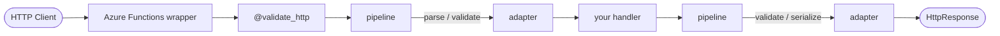

# Azure Functions Validation

[](https://pypi.org/project/azure-functions-validation/)
[](https://pepy.tech/project/azure-functions-validation)
[](https://pypi.org/project/azure-functions-validation/)
[](https://github.com/yeongseon/azure-functions-validation-python/actions/workflows/ci-test.yml)
[](https://github.com/yeongseon/azure-functions-validation-python/actions/workflows/publish-pypi.yml)
[](https://github.com/yeongseon/azure-functions-validation-python/actions/workflows/security.yml)
[](https://codecov.io/gh/yeongseon/azure-functions-validation-python)
[](https://pre-commit.com/)
[](https://yeongseon.github.io/azure-functions-validation-python/)
[](LICENSE)

다른 언어: [English](README.md) | [日本語](README.ja.md) | [简体中文](README.zh-CN.md)

**Azure Functions Python v2 프로그래밍 모델**을 위한 validation 및 serialization 라이브러리입니다.
이 패키지는 decorator 기반 `FunctionApp` HTTP 핸들러를 위한 typed request parsing과 response validation을 제공합니다.

## Why Use It

Azure Functions Python v2 핸들러는 다음과 같은 문제가 반복되기 쉽습니다.

- 반복적인 `req.get_json()` 호출과 수동 요청 파싱
- 일관되지 않은 `400` 및 `422` validation 응답
- 의도한 스키마와 조용히 어긋나는 response payload

`azure-functions-validation`은 Azure Functions 프로그래밍 모델에 가깝게 유지되는 decorator-first validation 레이어로 이런 문제를 해결합니다.

## Scope

- Azure Functions Python **v2 프로그래밍 모델**
- `func.FunctionApp()`에 등록된 HTTP 트리거 함수
- Pydantic v2 기반 request 및 response validation

이 패키지는 기존 `function.json` 기반의 v1 프로그래밍 모델을 대상으로 하지 않습니다.

## Features

- `@validate_http`를 통한 typed body, query, path, header validation
- `{"detail": [...]}` 형식의 자동 `400` / `422` 응답
- response model validation, 불일치 시 `ResponseValidationError` 발생(HTTP 500)
- `ErrorFormatter`를 통한 핸들러별 custom error formatting

## How it works

`@validate_http`는 import 시점에 검증 파이프라인을 한 번 구성한 뒤, 매 요청마다 실행합니다:



## Package names

세 가지 컨텍스트에서 세 가지 이름을 사용합니다.

| Context        | Name                                |
|----------------|-------------------------------------|
| GitHub repo    | `azure-functions-validation-python` |
| PyPI package   | `azure-functions-validation`        |
| Python import  | `azure_functions_validation`        |

저장소 이름에는 Python 구현체임을 표시하기 위해 `-python` 접미사가 붙어 있습니다. PyPI 패키지명은 Python 생태계 관례에 맞춰 접미사 없이 게시되므로 설치 명령은 `pip install azure-functions-validation`으로 자연스럽게 유지됩니다. 자세한 설명은 [FAQ](https://yeongseon.github.io/azure-functions-validation-python/faq/#why-does-the-repo-use--python-but-the-pypi-package-does-not)를 참고하세요.

## Installation

```bash
pip install azure-functions-validation
```

Azure Functions 앱 의존성에는 다음도 포함되어야 합니다.

```text
azure-functions
azure-functions-validation
```

로컬 개발용:

```bash
git clone https://github.com/yeongseon/azure-functions-validation-python.git
cd azure-functions-validation-python
pip install -e .[dev]
```

## Quick Start

```python
import azure.functions as func
from pydantic import BaseModel

from azure_functions_validation import validate_http


class CreateUserRequest(BaseModel):
    name: str
    email: str


class CreateUserResponse(BaseModel):
    message: str
    status: str = "success"


app = func.FunctionApp()


@app.function_name(name="create_user")
@app.route(route="users", methods=["POST"], auth_level=func.AuthLevel.ANONYMOUS)
@validate_http(body=CreateUserRequest, response_model=CreateUserResponse)
def create_user(req: func.HttpRequest, body: CreateUserRequest) -> CreateUserResponse:
    return CreateUserResponse(message=f"Hello {body.name}")
```

## Documentation

- 프로젝트 문서: `docs/`
- 스모크 테스트된 예제: `examples/`
- 제품 요구사항: `PRD.md`
- 설계 원칙: `DESIGN.md`

## Ecosystem

이 패키지는 **Azure Functions Python DX Toolkit**의 일부입니다.

**설계 원칙:** `azure-functions-validation`은 요청/응답 검증과 직렬화를 담당합니다. `azure-functions-openapi`는 API 문서화와 스펙 생성을 담당합니다. `azure-functions-langgraph`는 LangGraph 런타임 노출을 담당합니다.

| 패키지 | 역할 |
|---------|------|
| [azure-functions-openapi-python](https://github.com/yeongseon/azure-functions-openapi-python) | OpenAPI 스펙 생성 및 Swagger UI |
| **azure-functions-validation-python** | 요청/응답 검증 및 직렬화 |
| [azure-functions-db-python](https://github.com/yeongseon/azure-functions-db-python) | SQLAlchemy 기반 DB 통합 헬퍼 (폴링 기반 의사 트리거, 입력/출력/클라이언트 주입) |
| [azure-functions-langgraph-python](https://github.com/yeongseon/azure-functions-langgraph-python) | Azure Functions용 LangGraph 배포 어댑터 |
| [azure-functions-scaffold-python](https://github.com/yeongseon/azure-functions-scaffold-python) | 프로젝트 스캐폴딩 CLI |
| [azure-functions-logging-python](https://github.com/yeongseon/azure-functions-logging-python) | 구조화된 로깅 및 관측성 |
| [azure-functions-doctor-python](https://github.com/yeongseon/azure-functions-doctor-python) | 배포 전 진단 CLI |
| [azure-functions-durable-graph-python](https://github.com/yeongseon/azure-functions-durable-graph-python) | Durable Functions 기반 매니페스트 우선 그래프 런타임 *(실험적)* |
| [azure-functions-knowledge-python](https://github.com/yeongseon/azure-functions-knowledge-python) | 지식 검색(RAG) 데코레이터 |
| [azure-functions-cookbook-python](https://github.com/yeongseon/azure-functions-cookbook-python) | 도그푸드 예제 — 전체 툴킷을 활용하는 실행 가능한 레시피 |

## Disclaimer

이 프로젝트는 독립적인 커뮤니티 프로젝트이며 Microsoft와 제휴되어 있지 않고, Microsoft의 후원이나 유지보수를 받지 않습니다.

Azure 및 Azure Functions는 Microsoft Corporation의 상표입니다.

## License

MIT
