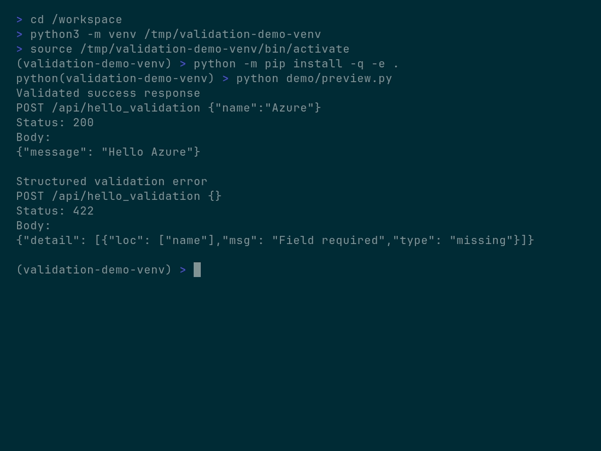

# azure-functions-validation

[](https://pypi.org/project/azure-functions-validation/)
[](https://pypi.org/project/azure-functions-validation/)
[](https://github.com/yeongseon/azure-functions-validation/actions/workflows/ci-test.yml)
[](https://github.com/yeongseon/azure-functions-validation/actions/workflows/release.yml)
[](https://github.com/yeongseon/azure-functions-validation/actions/workflows/security.yml)
[](https://codecov.io/gh/yeongseon/azure-functions-validation)
[](https://pre-commit.com/)
[](https://yeongseon.github.io/azure-functions-validation/)
[](LICENSE)

Validation and serialization for the **Azure Functions Python v2 programming model**.
This package provides typed request parsing and response validation for decorator-based `FunctionApp` HTTP handlers.

## Scope

- Azure Functions Python **v2 programming model**
- HTTP-triggered functions registered on `func.FunctionApp()`
- Pydantic v2-based request and response validation

This package does **not** target the legacy `function.json`-based v1 programming model.

## Installation

```bash
pip install azure-functions-validation
```

Your Azure Functions app should also include:

```text
azure-functions
azure-functions-validation
```

For local development:

```bash
git clone https://github.com/yeongseon/azure-functions-validation.git
cd azure-functions-validation
pip install -e .[dev]
```

## Quick Start

```python
import azure.functions as func
from pydantic import BaseModel

from azure_functions_validation import validate_http


class CreateUserRequest(BaseModel):
    name: str
    email: str


class CreateUserResponse(BaseModel):
    message: str
    status: str = "success"


app = func.FunctionApp()


@app.function_name(name="create_user")
@app.route(route="users", methods=["POST"], auth_level=func.AuthLevel.ANONYMOUS)
@validate_http(body=CreateUserRequest, response_model=CreateUserResponse)
def create_user(req: func.HttpRequest, body: CreateUserRequest) -> CreateUserResponse:
    return CreateUserResponse(message=f"Hello {body.name}")
```

## Features

- Typed body, query, path, and header validation
- Standardized 400 and 422 validation responses
- Response model validation and serialization
- Contract-testing utilities for handlers
- Optional custom and global validation error handlers

## Demo

The demo below shows the two core outcomes of `validate_http` on the representative example:

- a valid request becomes a typed JSON response
- an invalid request becomes a structured `422` validation error

The terminal demo is generated from [`demo/validation-demo.tape`](demo/validation-demo.tape)
with VHS.


The final terminal state is also captured as a static image for quick inspection.



## Documentation

- Project docs live under `docs/`
- Smoke-tested examples live under `examples/`
- Product requirements: `PRD.md`
- Design principles: `DESIGN.md`

## License

MIT
