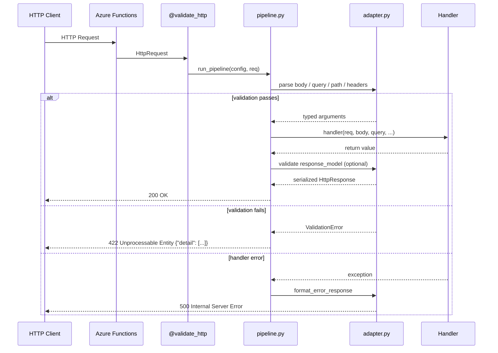
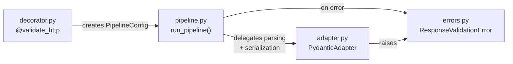

# Architecture

`azure-functions-validation` is intentionally small, explicit, and composable.
The package centers on one public abstraction: a decorator that enforces request
and response contracts around Azure Functions HTTP handlers.

## Design Objectives

- Keep public API minimal.
- Keep runtime validation deterministic.
- Separate framework integration from validation mechanics.
- Favor typed contracts over ad-hoc request parsing.
- Avoid global mutable configuration.

!!! tip "Mental model"
    The decorator builds a pipeline once at import time and executes that
    pipeline for each request.

## High-level flow

This flow is shared by sync and async handlers.

## Module responsibilities

### `decorator.py` (public entry point)

Owns:

- `validate_http(...)` API
- import-time configuration checks
- sync/async wrapper selection
- creation of immutable pipeline configuration

Not responsible for:

- actual per-request parsing and serialization logic

### `pipeline.py` (internal execution engine)

Owns:

- `PipelineConfig` data structure
- request object resolution
- input parsing orchestration
- response validation and serialization orchestration

Primary internal entry points:

- `run_pipeline(...)`
- `run_pipeline_async(...)`

### `adapter.py` (validation backend abstraction)

Owns:

- adapter protocol shape (`ValidationAdapter`)
- default implementation (`PydanticAdapter`)
- source parsing semantics (body/query/path/headers)
- serialization and default error formatting

!!! note "Extensibility"
    The adapter abstraction exists for advanced usage. Most deployments should
    keep the default `PydanticAdapter`.

### `errors.py` (error types and formatting)

Owns:

- `ResponseValidationError`
- `ErrorFormatter` alias
- `format_error_response(...)`

Error shaping policy:

- validation/parsing errors use structured JSON payloads
- 500-level internal errors are sanitized by default unless a custom formatter
  is provided

## Module boundaries

### What this package owns

| Concern | Description |
| --- | --- |
| Request extraction | Parse body/query/path/headers from `HttpRequest` |
| Runtime validation | Enforce Pydantic contracts before handler execution |
| Response enforcement | Validate outbound payloads against `response_model` |
| Error envelope policy | Emit consistent `{"detail": [...]}` validation payloads |
| Decorator semantics | Injection names and conflict rules |

### What this package does not own

- Azure Functions route registration mechanics
- Authentication and authorization
- Business/domain logic
- Data persistence
- OpenAPI specification generation or documentation rendering

## Public API Boundary

Exported symbols (via `__all__`):

- `validate_http` — decorator for HTTP request/response validation
- `ResponseValidationError` — exception type for response model validation failures
- `SerializationError` — exception type for response serialization failures
- `ErrorFormatter` — type alias for custom error formatting callables
- `__version__` — package version string

Everything else (`PipelineConfig`, `PydanticAdapter`, `ValidationAdapter` protocol, internal pipeline functions) is not part of the top-level public API.

## Key Design Decisions

### 1. Pydantic v2 adapter pattern

Validation is delegated to a `ValidationAdapter` protocol. The default `PydanticAdapter` uses Pydantic v2 for validation and type coercion. The protocol exists for extensibility but most deployments should use the default.

### 2. Immutable pipeline configuration

`PipelineConfig` captures all decorator parameters at decoration time and is frozen for the lifetime of the handler. Per-request validation reuses the same config without mutation.

### 3. Keyword-only decorator parameters

`validate_http(...)` accepts only keyword arguments. This prevents positional-argument mistakes and makes call sites self-documenting.

### 4. Sync/async wrapper selection

The decorator inspects the handler at decoration time and selects either `_sync_wrapper` or `_async_wrapper`. No runtime branching per request.

### 5. Import-time configuration validation

Invalid decorator configuration (e.g. conflicting parameters) raises exceptions at decoration time (typically module import). This fails fast rather than surfacing errors only at request time.

## Invariants and guarantees

- `validate_http` parameters are keyword-only.
- first positional handler parameter must be request-like.
- `request_model` cannot be combined with other request source parameters.
- response model validation runs unless handler returns `HttpResponse` directly.
- custom formatter is handler-scoped.

!!! warning "Import-time failures"
    Invalid decorator configuration raises exceptions when modules are imported,
    not only at request time.

## Anti-patterns to avoid

| Anti-pattern | Why it causes problems |
| --- | --- |
| Reimplementing request parsing inside handlers | Duplicates validation logic and increases drift |
| Skipping `response_model` on public APIs | Allows accidental contract breakage |
| Coupling this package to external API documentation types | Reduces modularity and maintainability |
| Overusing custom formatters everywhere | Fragments client error handling contracts |

## Related Documents

- [Usage](usage.md)
- [Configuration](configuration.md)
- [API Reference](api.md)
- [Troubleshooting](troubleshooting.md)

## Sources

- [Azure Functions Python developer reference](https://learn.microsoft.com/en-us/azure/azure-functions/functions-reference-python)
- [Azure Functions HTTP trigger](https://learn.microsoft.com/en-us/azure/azure-functions/functions-bindings-http-webhook-trigger)
- [Supported languages in Azure Functions](https://learn.microsoft.com/en-us/azure/azure-functions/supported-languages)

## See Also

- [azure-functions-openapi — Architecture](https://github.com/yeongseon/azure-functions-openapi) — OpenAPI spec generation
- [azure-functions-logging — Architecture](https://github.com/yeongseon/azure-functions-logging) — Structured logging with contextvars
- [azure-functions-doctor — Architecture](https://github.com/yeongseon/azure-functions-doctor) — Pre-deploy diagnostic CLI
- [azure-functions-scaffold — Architecture](https://github.com/yeongseon/azure-functions-scaffold) — Project scaffolding CLI
- [azure-functions-langgraph — Architecture](https://github.com/yeongseon/azure-functions-langgraph) — LangGraph agent deployment
